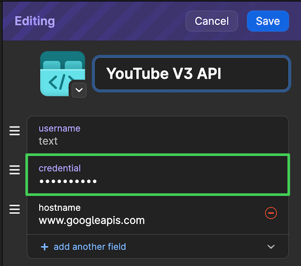

## YouTube URL Extractor

Finds any YouTube URLs in the current clipboard text, and queries Google's YouTube V3 API to fetch metadata about each one.

### How to use

Copy some text containing YouTube URLs to the clipboard, then activate this workflow's trigger keyword.

Results are displayed in a list, reverse-sorted by video post date. The complete results can be copied as markdown links ("Copy all items in Markdown link format" option), or opened individually. Hold the <kbd>OPTION</kbd> key to toggle the subtitle between the post date and the full title if it's long/truncated. If you action the "Copy all items..." option while holding <kbd>OPTION</kbd>, the results will be shown in a TextView first to allow the list to be edited before copying.

QuickLook is enabled for the items as a simple “live preview” by pressing the <kbd>SHIFT</kbd> key with a result selected.

### ⚠️ Requires an API key!

You must create a Google Cloud project at https://console.cloud.google.com, grant it access to the [YouTube V3 API](https://developers.google.com/youtube/v3/docs/), and then create an API key credential for use within this workflow.

Once you have your key, you can input it directly, or store it in 1Password if you prefer (create a new 'API Credential' item, and copy its UUID)



### Terminal CLI

The `ytx.py` script contained in this workflow has no special dependencies, and is designed to run standalone in a shell as well. Create a symlink for convenience by right-clicking the workflow in Alfred, choosing **Open in Terminal** and then typing: `ln -s ytx.py /usr/local/bin`.

Once that's done, the syntax of the command is:

```
ytx.py [-cmx] <url-or-filename> [url2...]
```

- Args can be YouTube URLs or filenames (if a filename is used, it will be scanned for URLs)
- You can mix & match URLs and filenames as args
- Default output is JSON
- The `-c` option will use the clipboard contents instead of args
- The `-m` option will output Markdown format links
- The `-x` option will output Markdown links with a little more detail (duration and date posted)
